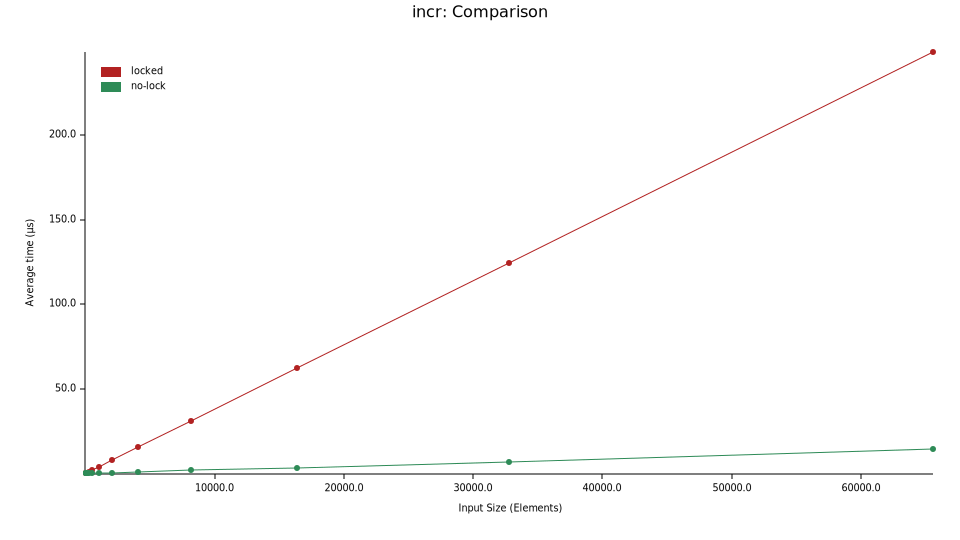

# Benchmarking the overhead of locking a mutex


To see the benchmark results:
```
git clone https://github.com/mendess/experiments
cd experiments/lock-bench
$BROWSER ./benchmark-results/report/index.html
```

there `$BROWSER` is whatever browser you use.



